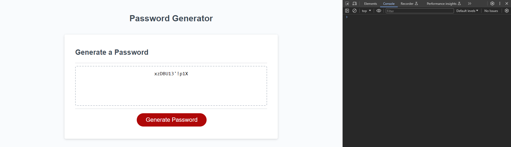
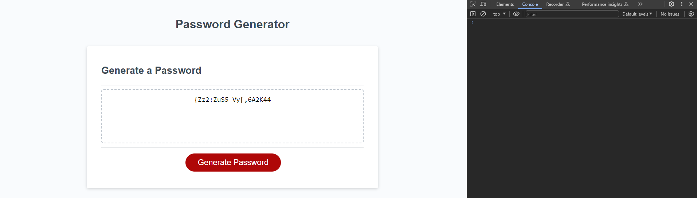

# Secure-Password-Generator

A password generator based on user input.

## Description

- Purpose of this programme is to get the user input to decide what sort of password is to be generated.
- If the user states they want their password to be below 8 characters in length or above 128 characters, it will let the user know the password should be between those numbers.
- It will prompt the user to ask whether they want lowercase, uppercase, numerals and special characters.
- Once they click the generate button after the prompts it will generate the password according to the user input.

[GitHub page](https://github.com/Digita1Panda/secure-password-generator)

[Financial Analysis](https://digita1panda.github.io/secure-password-generator/)

## Installation

N/A

## Usage

## Credits

N/A

## License

MIT License20

Copyright & All rights Reserved (c) 2023 Kwok Law

Permission is hereby granted, free of charge, to any person obtaining a copy of this software and associated documentation files (the “Software”), to deal in the Software without restriction, including without limitation the rights to use, copy, modify, merge, publish, distribute, sublicense, and/or sell copies of the Software, and to permit persons to whom the Software is furnished to do so, subject to the following conditions:

The above copyright notice and this permission notice shall be included in all copies or substantial portions of the Software.

THE SOFTWARE IS PROVIDED “AS IS”, WITHOUT WARRANTY OF ANY KIND, EXPRESS OR IMPLIED, INCLUDING BUT NOT LIMITED TO THE WARRANTIES OF MERCHANTABILITY, FITNESS FOR A PARTICULAR PURPOSE AND NONINFRINGEMENT. IN NO EVENT SHALL THE AUTHORS OR COPYRIGHT HOLDERS BE LIABLE FOR ANY CLAIM, DAMAGES OR OTHER LIABILITY, WHETHER IN AN ACTION OF CONTRACT, TORT OR OTHERWISE, ARISING FROM, OUT OF OR IN CONNECTION WITH THE SOFTWARE OR THE USE OR OTHER DEALINGS IN THE SOFTWARE.

---

## Badges

## Features

N/A

## Contributing

## Tests

N/A

---

© 2023 edX Boot Camps LLC. Confidential and Proprietary. All Rights Reserved.
